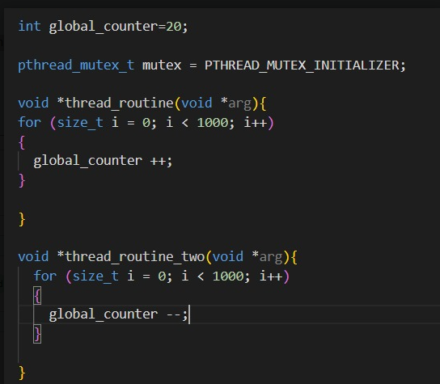

# Actividad: Condiciones de carrera y sección crítica

## Objetivo

Implementar el pseudocódigo proporcionado en C y experimentar con mecanismos de sincronización para identificar **condiciones de carrera** y comprender el concepto de **sección crítica**.



## Instrucciones

1. Implementa el pseudocódigo en un archivo llamado `race_test.c`, utilizando `pthread`.

2. Ejecuta el programa **sin sincronización** y observa el valor final de `global_counter`.

3. Implementa y prueba un mecanismo de sincronización, por ejemplo, `pthread_mutex`, para proteger el acceso a `global_counter`.

4. Explica con tus palabras:
   - ¿Qué es una **condición de carrera**?
   - ¿Por qué puede producir resultados diferentes al ejecutar varias veces el programa?
   - ¿Qué es una **sección crítica** y qué parte del código corresponde a ella?

5. Genera el código ensamblador con:

   ```bash
   gcc -S race_test.c

   ```

6. Analiza el archivo .s generado e identifica las instrucciones:

- movl
- addl
- subl

7. Explica brevemente qué función cumple cada una de estas instrucciones en la operación sobre global_counter.

## Entrega

Incluye en el repositorio:

- codigo_fuente.c
- Código con y sin sincronización.
- Una breve explicación de la condición de carrera y la sección crítica. (formato pdf en el classroom)
- Una captura o fragmento del código ensamblador donde se identifiquen movl, addl y subl.
- Una conclusión breve sobre los resultados obtenidos.
