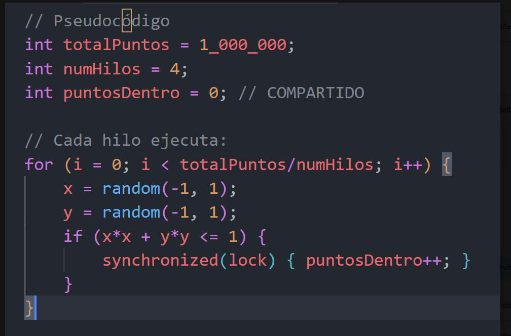

# Práctica: Cálculo de π con hilos y semáforos

### Objetivo

Implementar el pseudocódigo proporcionado utilizando **hilos y semáforos**, distribuyendo la generación de puntos aleatorios entre varios hilos.



### Instrucciones

1. Implemente el pseudocódigo utilizando **hilos**.
2. Divida `totalPuntos` entre el número de hilos para repartir la carga de trabajo.
3. Cada hilo deberá generar puntos aleatorios `(x, y)` entre `-1` y `1`.
4. Determine si cada punto se encuentra dentro del círculo:

   ```text
   x*x + y*y <= 1
   ```
5. Utilice un **semáforo** para proteger el acceso a la variable compartida `puntosDentro`.
6. Espere a que todos los hilos terminen antes de calcular π:

   ```text
   π = 4.0 * puntosDentro / totalPuntos
   ```
7. Mida el tiempo total de ejecución.
8. Realice pruebas utilizando diferentes cantidades de hilos:

   * 2
   * 8
   * 16
9. Mantenga `totalPuntos = 1,000,000` durante las pruebas.
10. Registre los resultados y compare el **tiempo de ejecución** obtenido con cada cantidad de hilos.

### Entregables

* Código fuente.
* Tabla de resultados.
* Gráfica de **número de hilos vs. tiempo de ejecución**.
* Breve conclusión indicando qué cantidad de hilos obtuvo el mejor rendimiento y por qué.

### Pregunta de análisis

> ¿Aumentar la cantidad de hilos siempre mejora el rendimiento? Explique sus resultados.
